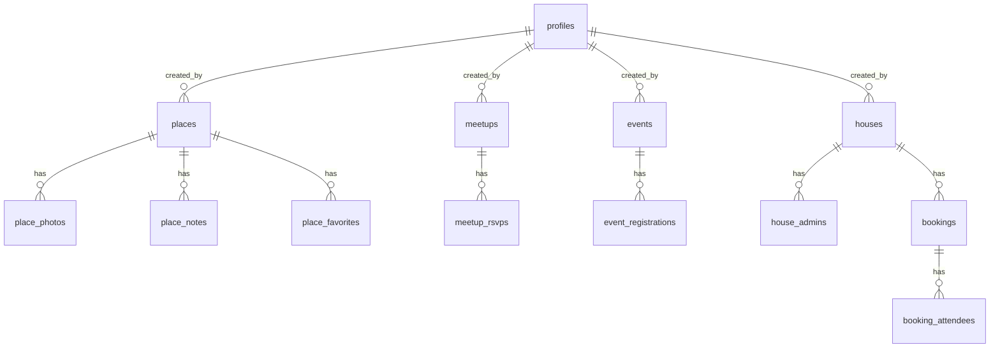

# Schema Notes

Short descriptions:
- profiles: Member identity and public info
- places: Curated locations; creator-linked; supports photos, notes, tags
- meetups: Member-organized meetups; supports RSVPs and tags
- events: Official events; supports registrations and activity
- houses: Physical houses/venues; bookings, photos, admins, availability
- user_settings: Per-user app settings (JSON)
- app_admins/app_memberships: Admin membership and tiering
- notifications/webhook_outbox/audit_log: System messaging & logs

ER (core):

Notes:
- Geometries are WGS84 (SRID 4326); PostGIS required.
- UUID generation uses gen_random_uuid(); pgcrypto required.
- Enum starter sets live under 10_enums and can evolve.
- All create statements are idempotent; safe to re-run.

